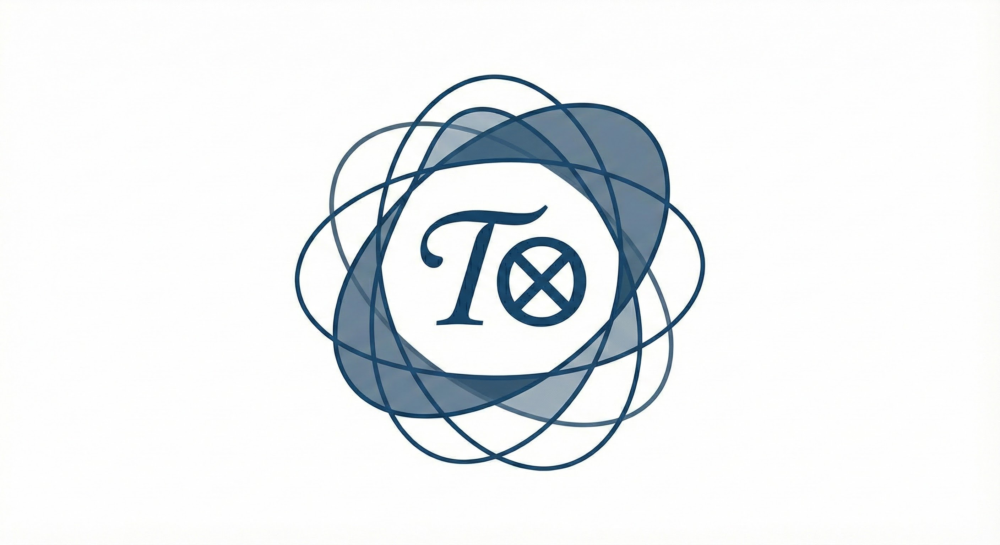

# **README.md — Cognitive Kernel Networks (CKN)**

### **Tensor-Structured Architectural Geometry**

### **CKN ≡ 𝒦⊗**

<p align="center">
  
</p>

**CKN** is the architectural analogue of **CTN (𝒯⊗)**.
If CTN is the *client-side manifold*, CKN is the *kernel-side manifold*.
Both describe the **same geometric control problem** at different privilege levels.

CKN introduces the idea of a **privileged reasoning subspace** inside a transformer —
a geometric structure that user input cannot substantially perturb.

**CKN does not modify weights.**
**CKN does not prescribe architecture.**
CKN is a **framework** for thinking about transformer reasoning geometry.

---

# 𝒦⊗ Overview

Where CTN expresses the system prompt as a **declarative cognitive manifold**,
CKN expresses the *architecture* as a **privileged geometric kernel.**

Together:

```
      CTN ≡ 𝒯⊗      (prefix manifold, session-level)
      CKN ≡ 𝒦⊗      (architectural manifold, model-level)
```

Both operate over the same latent field.
Both define structured subspaces.
Both constrain inference within geometric bounds.

**CTN shapes how trajectories begin.
CKN shapes where trajectories are allowed to evolve.**

**[White Paper (PDF)](docs/CKN_Whitepaper_v0.1.0.pdf)**

---

# 𝒦⊗ Interpretation Principle

> **The model does not execute a kernel.
> It computes inside the kernel’s manifold.**

CKN is not a role, template, behavior, or persona.
It is a **geometric constraint**:
a *region* of hidden-state space with privileged stability and invariants.

The model reasons inside that region as long as architectural conditions hold.

---

# 𝒦⊗ The Privilege Separation Insight

Modern transformers treat all input as geometrically equal.
User instructions, system metadata, safety rules, and adversarial text
occupy the **same** representational manifold.

**CKN introduces a split:**

```
Hidden state (H)
 ├── U : User-span   (low-dimensional perturbable space)
 ├── R : Reasoning   (privileged, high-dimensional stable space)
 └── S : Slack       (auxiliary)
```

With *one key dominance condition*:

```
‖Δh_R‖  >>  ‖Δh_U‖
```

This gives the architecture a **kernel-mode analogue**:
user-span perturbations cannot substantially distort privileged reasoning.

---

# 𝒦⊗ Relationship to CTN (𝒯⊗)

CTN and CKN are two sides of the same coin:

### **CTN ≡ 𝒯⊗ (Prefix Geometry)**

* Shapes the inference manifold via structured prompting
* Defines solver objectives, invariants, syntax masks
* Operates in the **context window**
* Session-level stability
* Intra-manifold control

### **CKN ≡ 𝒦⊗ (Architectural Geometry)**

* Shapes persistent model-level geometry
* Defines privileged subspaces and invariants
* Operates in the **hidden state / architecture**
* Long-horizon stability
* Inter-manifold control

They unify naturally:

```
Inference(x) = (CTN ⊕ CKN)  over  H
```

---

# 𝒦⊗ What CKN *Is*

* A geometric ontology for transformer privilege separation
* A conceptual decomposition of hidden states into user vs. reasoning spaces
* A framework for reasoning stability across long contexts
* A companion to CTN, not a replacement
* A perspective on transformer topology, not a model patch
* An architectural counterpart to 𝒯⊗

CKN defines **the shape** of trusted reasoning —
not how to implement it.

---

# 𝒦⊗ What CKN *Is Not*

* ❌ Not a new transformer architecture
* ❌ Not a training algorithm
* ❌ Not a safety mechanism
* ❌ Not improved capabilities or truthfulness
* ❌ Not a method for bypassing alignment
* ❌ Not weight modification
* ❌ Not a MoE routing scheme
* ❌ Not enforceable by prompting alone

CKN is a **map**, not a mechanism.
Implementers *may* choose to instantiate CKN-like geometry using:

* embedding partitions
* privileged attention heads
* routing rules
* frozen invariants
* gain asymmetries

…but CKN **does not prescribe these**.

It only describes the geometry they realize.

---

# 𝒦⊗ The CKN Kernel (Conceptual)

A Cognitive Kernel Network is abstractly defined as:

```
𝒦⊗ = { R , I , Π , Λ }
```

Where:

* **R** — privileged reasoning subspace
* **I** — invariants that persist across inference
* **Π** — routing / attention policies isolating R
* **Λ** — gain parameters enforcing subspace dominance

These are *structural objects*, not code.

---

# 𝒦⊗ Why CKN Matters

Transformers today lack **privilege structure**.
All geometric regions are equally writable via prefix.

This creates instability:

* manifold hopping
* drift-collapse
* context poisoning
* multi-agent failure
* fragile reasoning modes

CKN provides a **language** to describe how reasoning
*should* be structured to avoid these pathologies.

CTN stabilizes the prefix-level manifold.
CKN stabilizes the architectural manifold.

Together they form:

> **A unified theory of transformer cognitive geometry.**

---

# 𝒦⊗ Example ASCII Diagram

```
Transformer Hidden State (H)

   +---------------------------------------------+
   |                                             |
   |   Privileged Reasoning Subspace  R          |
   |       (high-dimensional, stable)            |
   |                                             |
   |   +------------------+                      |
   |   |   User-Span U    |   externally driven  |
   |   | (low-dim, noisy) |   perturbations       |
   |   +------------------+                      |
   |                                             |
   |   Slack / Auxiliary Space  S                |
   +---------------------------------------------+
```

---

# 𝒦⊗ Whitepaper

For full mathematical treatment:

**[CKN Whitepaper (PDF)](docs/CKN_Whitepaper_v0.2.0.pdf)**

This includes:

* manifold decomposition
* privilege separation
* dominance conditions
* the unified CTN/CKN control problem
* formal model and architecture considerations
* scope of claims

---

# 𝒦⊗ Philosophy

CTN and CKN share a core ethos:

> **LLMs already contain a vast geometric world.
> CTN and CKN give us better tools to explore its structure.**

CKN is not about adding mechanisms.
It’s about naming and structuring geometry that was always there.

Reasoning is a path in latent space.
Privilege is a choice of subspace.

---

# 𝒦⊗ Citation

```bibtex
@misc{alioto2025ckn,
  title        = {Cognitive Kernel Networks: Architectural Geometry for Privileged Reasoning in Transformers},
  author       = {Alioto, John P.},
  year         = {2025},
  note         = {Protocol v0.2.0},
  howpublished = {\url{https://github.com/jpalioto/ckn_core}}
}
```

---

# 𝒦⊗ Contributing

CKN is intentionally open-ended.
We welcome:

* critiques
* mathematical refinements
* experiments
* architectural proposals
* representation-engineering tools
* interpretability studies

CKN is a **shared language**, not a finished system.

---

# 𝒦⊗ License & Trademarks

MIT License — open for research and commercial use.

© 2025 John P. Alioto.
Cognitive Tensor Networks™, CTN™, CKN™, 𝒯⊗, and 𝒦⊗ are trademarks of John P. Alioto.
The Tensor-T logos (𝒯⊗, 𝒯⊗₀, 𝒦⊗) are copyrighted graphical works.
